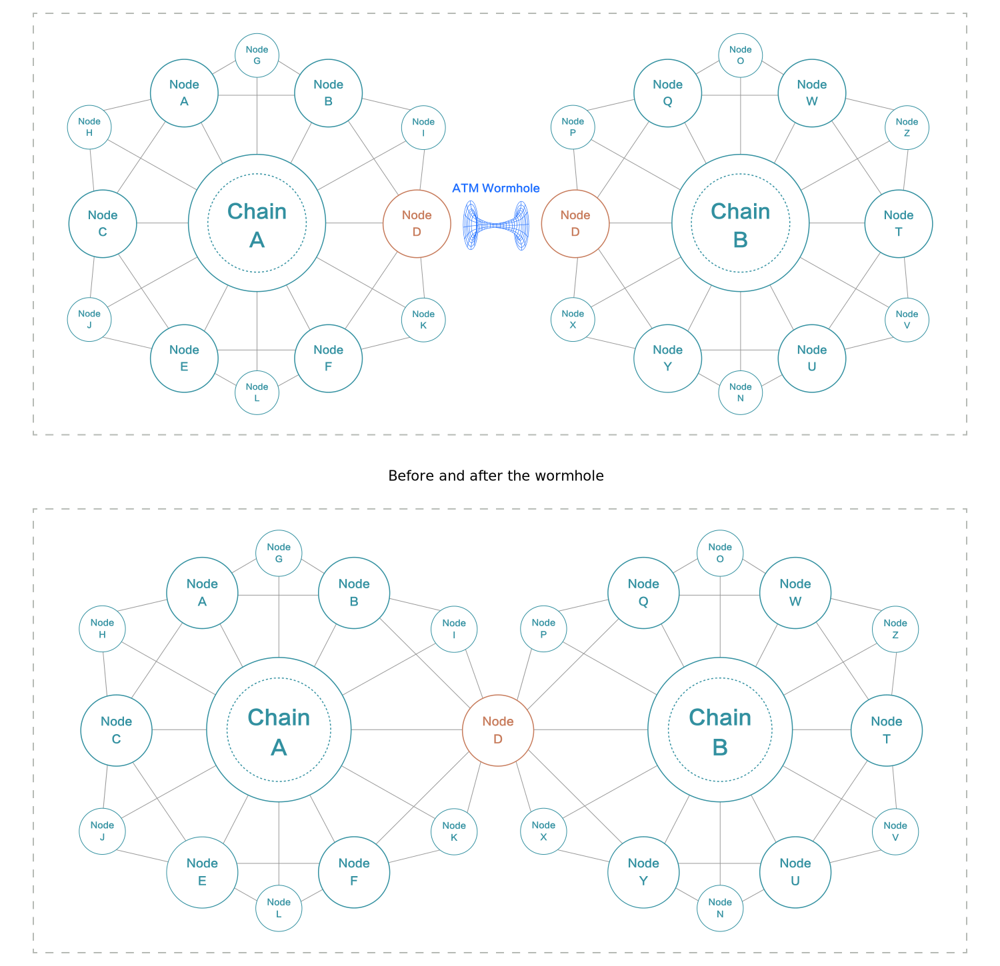

## ATM Introduction
Autonomous Trust Momentum（ATM）is a decentralized mechanism based on multiple blockchains, leveraging “consensus contracts” to construct the wallet network (i.e., user consensus network).

By building “consensus connections” between users, ATM locks the cryptocurrency consensus of users into connections between them. As more connections are built, a large network is formed. It transforms the “independent consensus” of users into a network-based “relative consensus”, making the consensus more stable.

The essence of decentralized finance is to allow people to establish consensus in a decentralized system through blockchain technology, subsequently a new economic system will be created. The mission of ATM is to help this decentralized consensus to establish faster and more stable, thereafter build a decentralized consensus network. On this consensus network all DeFi applications are compatible, a new decentralized economic system will be formed.

## ATM Smart Contract-Consensus Contract
ATM provides a smart contract technology called "consensus contract". This contract allows users of blockchain and digital currency to connect with each other on multiple public chains that support smart contracts, such as Ethereum, EOS, TRON, SECRET and NEO. This connection is: "Consensus connection".

User A can use the consensus contract to initiate a request for establishing a consensus connection with user B. If B agrees, the contract can be executed and the connection is established successfully.

## The content of the consensus contract includes:
  - 1.The currency invested by both A and B parties (Initially includes mainstream currency options, such as BTC, ETH, etc., and the community can vote to add or remove any available currency).
  - 2.The amount invested by each party (it is decided by both parties and can be the same or different).
  - 3.The lock-up time of the contract (which is not restricted). During the contract lock-up period, the contract cannot be cancelled unilaterally, however the two parties can jointly initiate the cancellation of the contract (The cancellation time is 72 hours, which means it takes 72 hours before the assets in the contract can be returned to the accounts of both parties). After the contract expires, it can be unilaterally terminated; or the contract will stay valid until either party instruct to terminate it. 

## Wormhole
Wormhole, also known as Einstein-Rosen Bridge, is a narrow tunnel connecting two different time and space that may exist in the universe.  Instantaneous space transfer or time travel could be achieved by travel through wormhole. In ATM, "wormhole" refers to "cross-chain contracts" that can operate on multiple public chains.

Users can connect their wallet addresses on different public chains through the "wormhole contract" provided by ATM. In the PageRank algorithm of ATM, the addresses of these two different public chains will be regarded as a node in the network. Through the merging of cross-chain addresses, ATM networks on different public chains will become an integrated whole.

